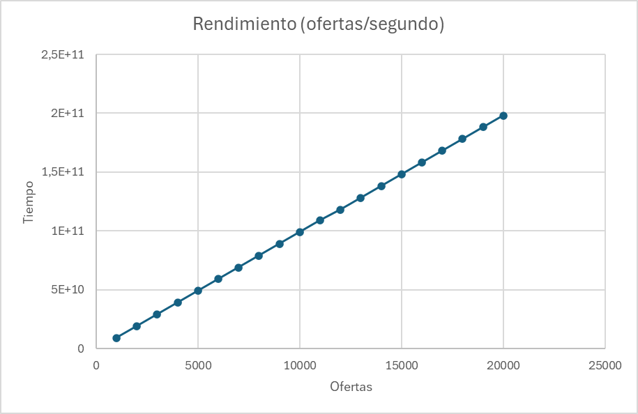
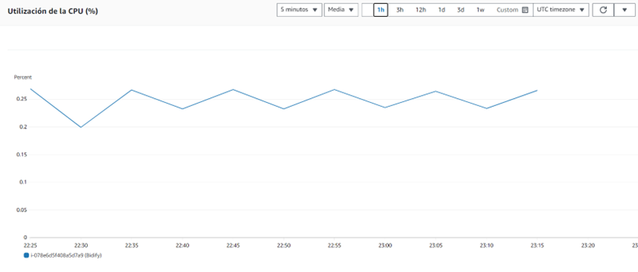
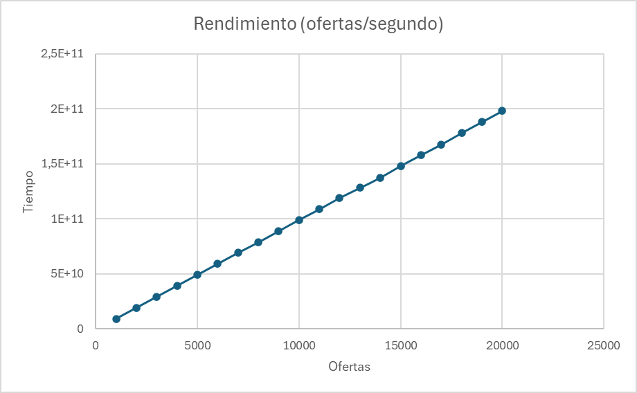
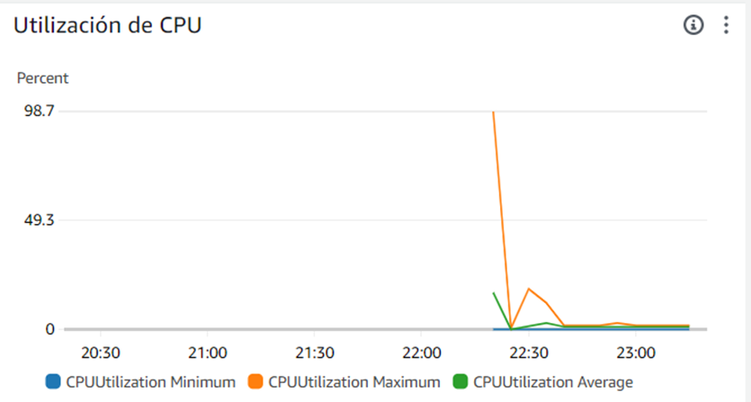
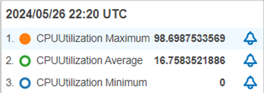
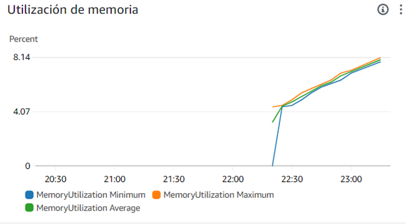
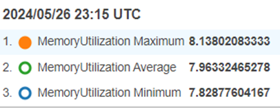

# Bidify
Bidify es una innovadora plataforma de subastas en línea diseñada para transformar la forma en que compramos y vendemos productos. Esta aplicación ofrece una experiencia emocionante tanto para vendedores como para compradores, facilitando la compra y venta de artículos a través de subastas dinámicas.
## Descripción del Programa
Bidify permite a los usuarios listar productos para la venta y establecer un precio inicial. Una vez que el producto está listado, los compradores pueden hacer ofertas competitivas, elevando el precio hasta que la subasta finalice. El comprador con la oferta más alta al cierre de la subasta se adjudica el producto.
## Características Principales
* **Registro de Productos:** Los vendedores pueden registrar fácilmente sus productos, establecer un precio inicial y definir la duración de la subasta.
* **Pujas en Tiempo Real:** Los compradores pueden hacer ofertas en tiempo real, compitiendo con otros usuarios para adquirir el producto deseado.
* **Sistema de Notificaciones:** Tanto compradores como vendedores reciben notificaciones sobre el estado de sus subastas, asegurando que estén siempre informados sobre las últimas ofertas.
* **Historial de Transacciones:** Los usuarios pueden revisar sus actividades pasadas, incluyendo subastas ganadas y productos vendidos.

La concurrencia en la aplicación se maneja mediante el uso de mecanismos de sincronización y estructuras de datos seguras para múltiples hilos, lo que garantiza que múltiples usuarios puedan interactuar con la plataforma en tiempo real sin conflictos. Cuando varios usuarios realizan acciones como hacer ofertas, registrar productos o recibir notificaciones, la aplicación utiliza bloqueos y colas de mensajes para coordinar estas operaciones, evitando condiciones de carrera y asegurando la integridad de los datos. Además, se implementan transacciones atómicas en la base de datos para mantener la consistencia y la precisión de las subastas, asegurando que cada puja y actualización de estado se procesen correctamente sin interferencias.
## Prerrequisitos
Necesitarás tener instaladas las siguientes herramientas y dependencias:

* **Java Development Kit (JDK) 17:** Asegúrate de tener instalado el JDK 17 en tu sistema. Puedes descargarlo e instalarlo desde el sitio web oficial de Oracle o utilizar una distribución OpenJDK.

* **Apache Maven:** Maven es una herramienta de gestión de proyectos que se utiliza para construir y gestionar proyectos Java. Asegúrate de tener instalado Maven en tu sistema. Puedes descargarlo e instalarlo desde el sitio web oficial de Apache Maven.

* **Git:** Git es un sistema de control de versiones distribuido que se utiliza para gestionar el código fuente del proyecto. Asegúrate de tener instalado Git en tu sistema si deseas clonar el repositorio del proyecto desde GitHub.

* **Spring Boot:** Al utilizar Spring Boot, la aplicación se ejecutará en un servidor de aplicaciones embebido, por lo que no necesitarás instalar un servidor de aplicaciones por separado. Spring Boot manejará todo el ciclo de vida de la aplicación.

## Desarrollo Experimental
La aplicación se posiciona como un entorno de pruebas fundamental para evaluar dos enfoques de despliegue en la nube: Amazon EC2 y Amazon ECS.

**EC2 (Elastic Compute Cloud):** Este servicio de cómputo en la nube de Amazon Web Services (AWS) proporciona una infraestructura escalable y segura para alojar aplicaciones web. EC2 permite a los usuarios lanzar y gestionar instancias virtuales, lo que brinda un alto grado de flexibilidad y control sobre el entorno de ejecución de la aplicación. Cada instancia EC2 puede personalizarse según los requisitos de la aplicación, desde la capacidad de procesamiento hasta la configuración del sistema operativo y las redes.

**ECS (Elastic Container Service):** Por otro lado, ECS es un servicio de orquestación de contenedores que simplifica la gestión y el despliegue de aplicaciones basadas en contenedores en AWS. Utilizando ECS, los desarrolladores pueden encapsular su aplicación en contenedores Docker y luego desplegarla de manera eficiente en un clúster de instancias EC2 gestionado por ECS. Este enfoque proporciona una mayor portabilidad, escalabilidad y facilidad de administración, ya que ECS se encarga de tareas como la programación de contenedores, la gestión de clústeres y la escalabilidad automática.

## ¿Por qué comparar EC2 con ECS?

**Evaluación de rendimiento:** Comparar el rendimiento y la escalabilidad de la aplicación en ambos entornos puede ayudar a identificar cuál ofrece un mejor desempeño en términos de tiempo de respuesta, capacidad de carga y rendimiento general.

**Costo y eficiencia:** Analizar los costos asociados con cada enfoque de despliegue es crucial para optimizar los recursos y minimizar los gastos. EC2 y ECS tienen modelos de precios diferentes, por lo que es importante determinar cuál ofrece una relación costo-rendimiento más favorable para la aplicación Bidify.

**Simplicidad de administración:** Comparar la complejidad de administración y operación de la aplicación en EC2 y ECS puede ayudar a identificar cuál proporciona una experiencia de desarrollo y gestión más sencilla y eficiente para el equipo de desarrollo de Bidify.

**Escalabilidad y disponibilidad:** Evaluar la capacidad de cada enfoque para escalar horizontal y verticalmente, así como su capacidad para garantizar la disponibilidad y la tolerancia a fallos, es esencial para determinar cuál es más adecuado para las necesidades de la aplicación Bidify.

En resumen, la investigación y evaluación de EC2 y ECS como opciones de despliegue para la
## Arquitectura de la Aplicación
### Arquitectura general

El diseño de la arquitectura de la aplicación Bidify se ha planeado meticulosamente para asegurar una experiencia de usuario fluida y segura. Los clientes ingresarán a la aplicación a través de un navegador web, utilizando HTTPS para garantizar la seguridad de la comunicación. Esta interfaz de usuario está conectada a un frontend que interactúa con un backend mediante un API REST. El backend está compuesto por tres instancias de la aplicación, que pueden estar desplegadas en EC2 o en ECS, dependiendo del entorno de prueba. Cada una de estas instancias está dedicada a una entidad principal del sistema: Producto, Subasta y Usuario, asegurando una distribución clara y organizada de las responsabilidades y el procesamiento de datos.

Cada instancia de la aplicación está configurada para comunicarse directamente con una base de datos MongoDB, alojada en MongoDB Atlas, lo que permite una gestión de datos centralizada y eficiente. Además, para garantizar la seguridad y la integridad de las comunicaciones, cada instancia cuenta con su propio keystore y truststore. Estas herramientas son esenciales para la gestión de certificados digitales y claves criptográficas, asegurando que las conexiones entre los componentes del sistema sean seguras y confiables.
#### EC2

#### ECS

### Arquitectura específica
El experimento se diseñó para comparar el rendimiento de la aplicación Bidify utilizando dos entornos de despliegue diferentes: EC2 y ECS. En la arquitectura basada en EC2, los usuarios interactúan con la aplicación a través del navegador, enviando peticiones que son gestionadas por tres instancias de Bidify ejecutándose en instancias de EC2. Estas instancias están organizadas detrás de un balanceador de cargas, que distribuye las peticiones de manera equitativa entre ellas para garantizar la disponibilidad y el rendimiento. Cada una de estas instancias de la aplicación tiene acceso a una base de datos MongoDB, alojada en MongoDB Atlas, lo que permite la gestión centralizada de datos. Para el experimento, esta misma arquitectura fue replicada en ECS, donde en lugar de ejecutar las aplicaciones directamente en instancias EC2, se utilizaron contenedores gestionados por el servicio de contenedores ECS. Los contenedores de ECS, igual que las instancias EC2, están detrás de un balanceador de cargas y tienen acceso a la misma base de datos MongoDB en Atlas. El objetivo del experimento fue medir el tiempo que le toma al sistema procesar una función de subasta, donde varios usuarios realizan ofertas y se mide el tiempo de procesamiento en nanosegundos. Se realizaron múltiples pruebas con diferentes cantidades de ofertas para evaluar y comparar el rendimiento entre EC2 y ECS
#### EC2

#### ECS


## Funcionamiento
Para el experimento, se diseñó una función de subasta donde múltiples usuarios realizarían ofertas, con la cantidad de ofertas como variable. Esta función simula el comportamiento del sistema al procesar estas ofertas y devuelve el tiempo que lleva realizar este procesamiento, medido en nanosegundos. Se optó por medir el tiempo de procesamiento como una métrica clave para evaluar el rendimiento del sistema bajo diferentes cargas de trabajo.


https://github.com/JaiderArleyGonzalez/Bidify/assets/89174283/9fe0a829-f802-4b72-b813-faec6b01627e


https://github.com/JaiderArleyGonzalez/Bidify/assets/89174283/de678806-81c6-4686-9807-ae38d521c31b

Al realizar pruebas en EC2 y ECS, se buscaba comparar el rendimiento y la escalabilidad de ambos entornos en el procesamiento de la función de subasta bajo diferentes cargas de trabajo, representadas por diferentes cantidades de ofertas. Este enfoque experimental permitiría determinar cuál de los dos entornos sería más adecuado para el despliegue de la aplicación de subasta, considerando factores como el tiempo de procesamiento, la escalabilidad y la eficiencia en el uso de recursos.
## ¿Cómo se realizó la instalación?
### EC2
Creamos una instancia de EC2 en AWS. Esta máquina cuenta con las siguientes características:


Nos conectamos a ella y realizamos las siguientes instalaciones.

#### Git
Para la instalación de Git (con el objetivo de clonar el repositorio para correr cada servicio respectivo) ejecutamos el siguiente comando:

```
    sudo yum install -y git
```


#### Java

Para la instalación de Java, usaremos la versión 17 que es la que se estableció en el POM

```
    sudo yum install -y java-17-amazon-corretto-devel
```

#### Apache-Maven
```
    sudo wget https://repos.fedorapeople.org/repos/dchen/apache-maven/epel-apache-maven.repo -O /etc/yum.repos.d/epel-apache-maven.repo
```

```
    sudo sed -i s/\$releasever/6/g /etc/yum.repos.d/epel-apache-maven.repo
```

```
    sudo yum install -y apache-maven
```
Estas líneas de comandos son instrucciones para instalar Apache Maven en un sistema CentOS o Fedora utilizando el gestor de paquetes yum:

1. Descarga del archivo de repositorio de Maven: Utiliza el comando wget para descargar el archivo de repositorio de Apache Maven desde el repositorio de Fedora People y lo guarda en el directorio /etc/yum.repos.d/ con el nombre epel-apache-maven.repo.

2. Modificación del archivo de repositorio: Utiliza el comando sed para modificar el archivo de repositorio descargado, reemplazando la variable $releasever por 6. Esto se hace para especificar la versión de CentOS o Fedora que estás utilizando, ya que la variable $releasever se expandirá a la versión del sistema operativo.

3. Instalación de Apache Maven: Utiliza el comando yum para instalar Apache Maven junto con todas sus dependencias, utilizando la opción -y para confirmar automáticamente todas las preguntas de instalación con "sí".

### ECS
1. **Preparación del Contenedor:** Primero, necesitamos empaquetar la aplicación Spring Boot en un contenedor Docker. Esto implica crear un Dockerfile que especifique cómo se debe construir el contenedor, incluyendo la instalación de las dependencias y la configuración del entorno.

        

2. **Registro de Contenedores:** Debemos subir el contenedor Docker a un registro de contenedores, como Amazon ECR (Amazon Elastic Container Registry). Esto nos permite almacenar y gestionar tus imágenes de contenedor de forma segura en la nube.

    
    
    

3. **Definición del Servicio ECS:** Luego, definimos un servicio ECS en la consola de administración de AWS. Esto implica configurar parámetros como el tipo de tarea, la capacidad de cómputo, las reglas de escalado automático y la integración con otros servicios de AWS, como el equilibrador de carga y los grupos de seguridad.

4. **Configuración de la Tarea:** Creamos una definición de tarea ECS que especifica cómo se ejecutará el contenedor. Esto incluye la configuración de los recursos de la tarea, como la CPU y la memoria, así como la asignación de puertos y la configuración de variables de entorno.

5. **Despliegue de la Aplicación:** Una vez configurado el servicio y la tarea ECS, podemos desplegar la aplicación Spring Boot en ECS utilizando la consola de administración de AWS o herramientas de línea de comandos como AWS CLI. ECS se encargará de gestionar la infraestructura subyacente y garantizar que la aplicación esté en funcionamiento y escalada según sea necesario.
   
      

6. **Monitoreo y Escalado:** Finalmente, podemos monitorear el rendimiento de la aplicación utilizando servicios como Amazon CloudWatch y configurar reglas de escalado automático para ajustar la capacidad de cómputo del servicio ECS en función de la demanda de tráfico.

## Resultados del experimento

**EC2**

| Ofertas | Tiempo (nanosegundos) |
|---------|-----------------------|
| 1000    | 9159167336            |
| 2000    | 19113891696           |
| 3000    | 29108353902           |
| 4000    | 39101265262           |
| 5000    | 49094822946           |
| 6000    | 59083208659           |
| 7000    | 69075850069           |
| 8000    | 79081109041           |
| 9000    | 89070167534           |
| 10000   | 99063725857           |
| 11000   | 1,09056E+11           |
| 12000   | 1,18169E+11           |
| 13000   | 1,28147E+11           |
| 14000   | 1,38154E+11           |
| 15000   | 1,48149E+11           |
| 16000   | 1,58132E+11           |
| 17000   | 1,68145E+11           |
| 18000   | 1,78128E+11           |
| 19000   | 1,88146E+11           |
| 20000   | 1,98143E+11           |






|                  | Nanosegundos | Minutos      |
|------------------|--------------|--------------|
| Media            | 1,03666E+11  | 1.727768822  |
| Mediana          | 1,0406E+11   | 1.734333073  |
| Desviación Estandar | 58735470831 | 0.978924514  |
| Percentil 50     | 1,0406E+11   | 1.734333073  |
| Percentil 75     | 1,50645E+11  | 2.510751223  |
| Percentil 90     | 1,7913E+11   | 2.98550181   |

**ECS**

| Ofertas | Tiempo (nanosegundos) |
|---------|-----------------------|
| 1000    | 9117247536            |
| 2000    | 19088840373           |
| 3000    | 29088483556           |
| 4000    | 39094009159           |
| 5000    | 49059283787           |
| 6000    | 59065461260           |
| 7000    | 69089315266           |
| 8000    | 78620020371           |
| 9000    | 88797733869           |
| 10000   | 99067095671           |
| 11000   | 1,08624E+11           |
| 12000   | 1,19053E+11           |
| 13000   | 1,2813E+11            |
| 14000   | 1,37455E+11           |
| 15000   | 1,48144E+11           |
| 16000   | 1,57989E+11           |
| 17000   | 1,6766E+11            |
| 18000   | 1,78133E+11           |
| 19000   | 1,88143E+11           |
| 20000   | 1,98123E+11           |











|                  | Nanosegundos | Minutos      |
|------------------|--------------|--------------|
| Media            | 1,03577E+11  | 1.726285122  |
| Mediana          | 1,03846E+11  | 1.730760047  |
| Desviación Estandar | 58709836858 | 0.978497281  |
| Percentil 50     | 1,03846E+11  | 1.730760047  |
| Percentil 75     | 1,50605E+11  | 2.510091147  |
| Percentil 90     | 1,79134E+11  | 2.985560804  |

## Análisis
Al analizar los datos obtenidos para EC2 y ECS, podemos observar varias medidas estadísticas importantes que nos permiten comparar el rendimiento de ambas opciones de despliegue en la nube.

* **Media:** La media representa el valor promedio de los tiempos de ejecución de las operaciones en nanosegundos y minutos. En este caso, tanto para EC2 como para ECS, la media está en el orden de 1,03E+11 nanosegundos o aproximadamente 1,73 minutos, lo que sugiere un rendimiento similar en términos de velocidad promedio de procesamiento.

* **Mediana:** La mediana es el valor central de un conjunto de datos ordenados. Ambos EC2 y ECS muestran valores de mediana cercanos a sus respectivas medias, indicando una distribución simétrica de los datos.

* **Desviación Estándar:** La desviación estándar es una medida de dispersión que indica cuánto varían los datos respecto a la media. Para ambas opciones, la desviación estándar es aproximadamente 58.7 mil millones de nanosegundos o alrededor de 0.98 minutos, lo que sugiere una dispersión similar en los tiempos de ejecución.

* **Percentiles 50, 75 y 90:** Los percentiles son medidas que dividen un conjunto de datos en partes iguales. Por ejemplo, el percentil 50 (también conocido como la mediana) indica que el 50% de los datos están por encima y el 50% por debajo de ese valor. Los percentiles 75 y 90 indican valores por encima de los cuales se encuentran el 75% y el 90% de los datos, respectivamente. En este caso, los valores de los percentiles para EC2 y ECS muestran una tendencia similar, lo que sugiere una distribución comparable de los tiempos de ejecución.

Basándonos en estos resultados, aunque EC2 y ECS muestran un rendimiento similar en términos de velocidad promedio y distribución de los tiempos de ejecución, la diferencia principal radica en la gestión de la infraestructura y la escalabilidad. ECS ofrece una gestión simplificada y automatizada de contenedores, integración nativa con otros servicios de AWS, como Elastic Load Balancing y Auto Scaling, lo que facilita el despliegue y la gestión de aplicaciones a gran escala. Además, ECS proporciona una mayor flexibilidad en términos de arquitectura de aplicaciones, lo que permite adaptarse mejor a las necesidades específicas de cada proyecto. Aunque ambos servicios pueden ofrecer un rendimiento comparable, ECS emerge como la opción preferida debido a su mayor facilidad de gestión, escalabilidad y flexibilidad en el despliegue de aplicaciones en la nube.

## Autores
- Jaider Arley Gonzalez Arias
- Miguel Angel Barrera Diaz
